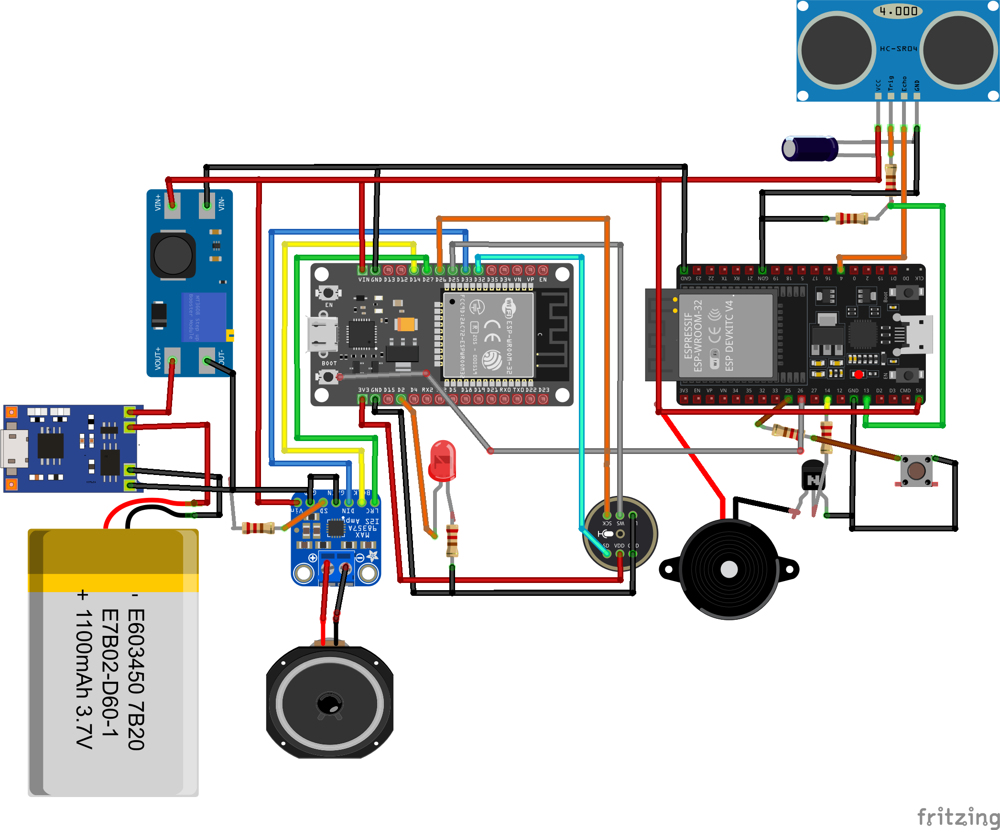

## AI VOICE ASSISTANCE AND PLAYBACK WITH WAKE-WORD TINY ML MODEL

---

press button

wifi AP name: Xiaozhi-8DCD

AP address: http://192.168.4.1/

enter wifi SSID and passord... connect

----

## WHAT DOES THIS DO?
This is an AI Voice Assistance device. The Aim of this project is to build a smart Audio Playback device that can assess human voice and make interraction based on Audio commands... Just like Alexa!

The Original intention is to mount this device on a Robot Dog (Unitree Go Air) as a standalone device so that users can make audio interraction with it and get smart response from it. It was originally planned to use `wakeword` algorithm from TinyML models using wakeword word such as "Hey RobotDog" to trigger a listening mode. 
Let's talk about the Components used...

---
## COMPONENTS 
### Logic Device
- ESP 32 DevKit V2 (30 Pins) for Xiaozhi integration
- ESP 32 Devkit V2 (38 pins) for Wakeword TinyML + Ultrasonic Sensor + Buzzer

### Power Devices
- Charging Module (TP4056)
- Boost Converter (MT3608)
- Switch
- Battery (2000mAh, 3.6V)

### Audio Devices 
- Digital MEMS Microphone (INMP441)
- Audio Amplifier (MAX98357)
- Speaker (4 ohms, 5W)

### Other Devices
- Ultrasonic Sensor
- Buzzer
- LEDs, Capacitors, SMD resistors, etc.

Below is a Simplified schematics from Fritzing... 

For a more detailed schematic, check [here](schematics\main_schematics.dch) or [here](images\schematics_image.png)

---
## CURRENT WORKING OPERATION
Currently, the Optimal goal has not been completely achieved... features such as Wakeword TinyML model has not been integrated yet. However, the simple LLM APi with Xiaozhi works very fine for now...

### Why Use Two ESP 32 modules?
Due to Lack of Compute power and lack of a `PSRAM` in ESP32 Devkit version, the system could not host all the features like wakeword, DSP, and others on a single board, hence the need for a subordinate and helping board.

### What the ESP 32 Modules do in Detail
- ESP 32 with 30 Pins: 
    - This is the main brain of the system
    - Connect to the Internet 
    - Help perform Wifi Configuration
    - Connects to Xiaozhi API for audio processing and Output
    - All DSP operations happen within this module
    - Audio output from Xiaozhi is processed and output via Audio Amplifier Module MAX98357 connected to this ESP 32 module.
    - for other features check [Here](xiaozhi-esp32-2.2.3\README.md)

- ESP32 with 38 Pins:
    - This is just a supporting MCU to perform simple operations
    - IT process Ultrasonic sensor data to trigger Buzzer when needed
    - Buzzer is connected to it
    - There is a plan to deploy a Custom wakeword TinyML model here.

### How to Configure Wifi
- Connect to Power, by connecting a USB cable to ESP32 30 pins module
- Then Press the Push Button (close to the Ultrasonic sensor) to enter wifi config mode
- Check your Phone or PC to search for the ESP 32 wifi address...
    - wifi AP name: `Xiaozhi-8DCD`
- Connect to the Wifi AP name above on your Phone or PC
- After Connection: Use any Web browser on the device connected on to visit the wifi address to complete the configuration. Details below:
    - `AP address`: http://192.168.4.1/
- Input the Hotspot `SSID` and `Password` you to connect to on the web page, the click connect...

- Then a Completion Message....

- On Successful Connection, the Speaker will make a sound to confirm that it has connected to internet and to the API.
- Then you can successfully interract with the device with speech.

### How to Speak and Get Response
- The Xiaozhi API offer three modes:
    - `Listening mode`: when the system is actually listening
    - `Idle Mode`: when the system has not been engaged for a short while
    - `Sleep Mode`: When the System is obviously in sleep mode

- Due to the Lack of wakeword model in this current version, the device cannot be woken up by words or calling its name... But, we have a physical BUTTON for that.
- Press the `Push Button` behind the Ultrasonic sensor to move the device to listening mode from Idle mode and Sleep mode.
- Future Version may consider using Wakeword instead of this Button.
- Once in Listening mode the very first time, the Blue LED of the Xiaozhi ESP module turns ON to indicate Listening.

## SCHEMATICS AND PCB 
for all schematics (Using DipTrace software) check the Schematics folder [here](schematics)

below is the PCB 3D design:

## HOW TO CONFIGURE THE XIAOZHI CODE_BASE
To configure or make any adjustments on the Xiaozhi codebase, I strongly recommend that attempts is first made to understand the structure of the codebase before making edits...

- Download Visual Studio Code (VS Code)
- Download the ESP-IDF extension 
- Follow instructions to configure the ESP-IDF extension
- Then open the folder [xiaozhi-esp32-2.2.3](xiaozhi-esp32-2.2.3)

## RECOMMENDATION AND FUTURE CONSIDERATIONS
- Look for a better ESP 32 Module that has a PSRAM and better Compute Power. 
    - Example: `ESP32 S3 series`
    - This will prevent using two different modules
- Implement Wakeword model provided by Xiaozhi or Train a custom TinyML wakeword model.
- Find a way to indicate with LED when the system is Listening, in Idle mode or when in Sleep Mode.

For more info, contact me on:
bolajijoshua35@gmail.com 

